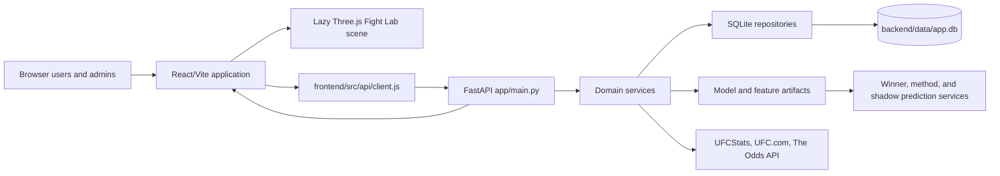
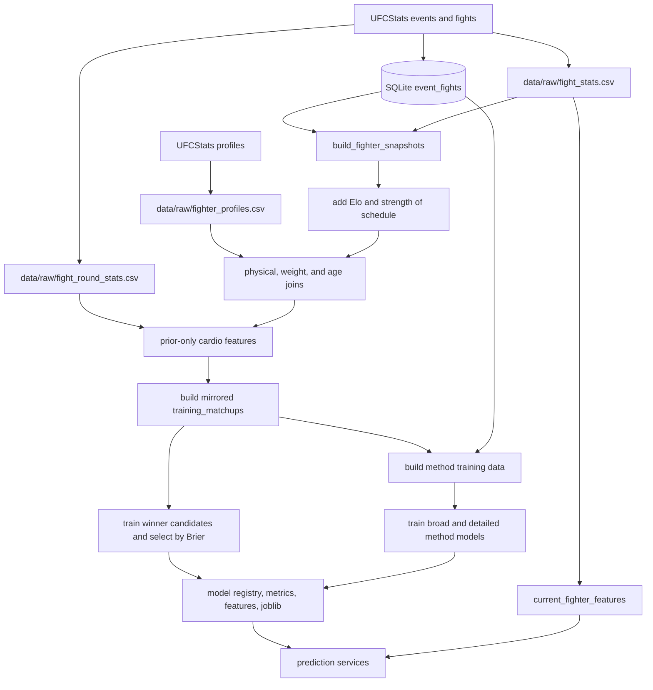

# FightIQ Project Architecture and Change-Impact Guide

Developer reference for the ThreeJS/FIGHT IQ application

Audited repository: `C:\Users\nrmcn\predictor\threejs`

Audited Git baseline: branch `threejs-playground`; commit baseline `60d9c84` plus the operational/evaluation-hardening change set documented here

Audit date: 2026-07-21 (America/New_York)

Document status: current implementation guide; completely rebuilt from the ThreeJS repository

## Document control and evidence rules

This guide is a standalone description of the audited checkout named above. Claims were checked against source code, local artifact schemas, configuration, repository documentation, and the validation commands listed in this guide.

Evidence labels used throughout:

- **Current:** implemented in the audited source or present in the audited local artifacts.
- **Current but data-empty:** implemented, but the audited artifact set contains no usable rows for that capability.
- **Experimental/shadow:** produced or evaluated without affecting the user-facing winner prediction.
- **Legacy/historical:** retained for history, migration, or comparison; not the current source of truth.
- **Planned:** documented intention without a complete production implementation.
- **Conflict:** source, artifact, or documentation statements disagree; the disagreement is stated rather than resolved by assumption.

The working tree was not clean during the audit: current odds data, maintained documentation, and generated model/evaluation artifacts had local changes. Model provenance also records `git_dirty: true`. The commit is therefore the code baseline, while row counts and artifact timestamps are a point-in-time local snapshot.

## Table of contents

1. Project overview
2. Repository structure
3. Runtime, dependency, and data architecture
4. Major component dependency matrix
5. Field-to-feature-to-UI traceability
6. Change-impact playbooks
7. Generated artifact registry
8. Versioning and compatibility
9. Development, training, and deployment workflows
10. Validation and safeguards
11. Risks, inconsistencies, and technical debt
12. Recommended improvement roadmap
13. Glossary
14. Before You Change Anything checklist

# 1. Project overview

## 1.1 Purpose and major capabilities

FIGHT IQ is a full-stack UFC analytics, prediction, and social prediction-game application. The current application provides:

- Winner probabilities for a single matchup and for upcoming cards.
- A separate broad/detailed manner-of-ending model.
- An experimental market-independent fight-duration survival curve, queried at an exact sportsbook line when available and always visible in the expanded Future Cards breakdown.
- A separate method-model P(Decision) value retained only as clearly labeled context.
- Optional current moneyline and rounds-total market comparison from The Odds API.
- Saved pre-event model snapshots, results grading, model-versus-market analysis, and limited closing-line-value tracking.
- Fighter profiles, Elo trends, fighter rankings, model evaluation, and data-quality views.
- Account authentication, personal picks, friends, user leaderboards, event-lock controls, and administrative data operations.
- A React/Vite interface with a lazy-loaded Three.js octagon scene in the Fight Lab experience.
- Local scraping/training plus bundle-based deployment to a single-container FastAPI/React service with a persistent volume.

The production winner model is market-blind. Odds are comparison and evaluation data, not winner-model inputs. Market-shadow models are explicitly experimental and do not drive the displayed winner pick.

## 1.2 Technology stack

| Layer | Current implementation | Primary evidence |
|---|---|---|
| Frontend | React 19, Vite 8, plain JavaScript/JSX, custom CSS, Vitest/Testing Library | `frontend/package.json`, `frontend/src/` |
| 3D | Three.js 0.182, lazy-loaded `OctagonScene` | `frontend/src/three/OctagonScene.jsx`, `frontend/src/App.jsx` |
| API | FastAPI 0.136, Pydantic request models, Uvicorn | `backend/app/main.py`, `backend/requirements.txt` |
| Data processing | Python 3.12 target, pandas, NumPy, BeautifulSoup, requests, Playwright fallback | `backend/app/data/`, `backend/app/pipeline/` |
| ML | scikit-learn winner/method pipelines, XGBoost candidates, experimental discrete-time duration survival artifact, joblib artifacts, SHAP dependency | `backend/app/models/`, `backend/models/` |
| Transactional storage | SQLite with WAL, schema-on-connect, repositories, forward column migration | `backend/app/db/`, `backend/app/repositories/` |
| Large analytical artifacts | CSV and JSON files under `backend/data/` and `backend/models/` | feature/model/pipeline modules |
| Deployment | Multi-stage Docker image, Fly.io configuration, optional Docker Compose VPS path | `Dockerfile`, `fly.toml`, `deploy/` |
| Automation | Windows Task Scheduler + DPAPI-protected admin/odds credentials + local pipeline + persisted health heartbeat + HTTPS bundle upload | `deploy/setup_auto_update.ps1`, `deploy/auto_update.*`, `data_refresh_runs` |
| CI | GitHub Actions: backend tests; frontend lint, tests, and build | `.github/workflows/ci.yml` |

## 1.3 Runtime architecture



The deployed container serves both the static frontend and the API. `FRONTEND_DIST` points FastAPI at the built frontend, so deployed browser/API traffic is same-origin. The container does not scrape or train; those operations run locally and are pushed as a data/model bundle.

## 1.4 User-facing applications and interfaces

| Interface | Route/view | Backend dependencies | Notes |
|---|---|---|---|
| My picks | `#/picks`, `MyPicks.jsx` | future-card detail, user predictions, event locks, card leaderboards | Default route for authenticated users; deliberately excludes model picks from the selection surface. |
| Friends | `#/friends`, `Friends.jsx` | friendships, comparison service, shared picks | Only mutually available/eligible pick information should be exposed. |
| Fight lab | `#/lab`, `FightLab.jsx` | `/predict`, `/predict-method`, fighter search | Uses `PredictionBreakdown`; Three.js scene is lazy-loaded. |
| Fighters | `#/fighters/<name>`, `FighterProfile.jsx` | fighter profile/image services | Deep-linkable hash route. |
| Future cards | `#/future`, `FutureCards.jsx` | future-card service, winner/method/duration models, odds, event controls | Shows a compact duration prediction, market O/U when available, and an always-visible duration curve in the expanded breakdown; P(Decision) remains separately labeled context. |
| Card results | `#/recent`, `RecentCards.jsx` | saved snapshots, results, grading, market/CLV services | Prospective evaluation; sample sizes remain small. |
| User leaderboard | `#/user-leaderboard` | predictions stats/leaderboard services | Multi-user game performance. |
| Fighter rankings | `#/leaderboards` | generated category-leader artifacts/service | Some scores are heuristic and must remain labeled. |
| Evaluation | admin | model, walk-forward, market, CLV, snapshot, data-quality services | Expert surface; several endpoints are admin-only. |
| Data ops | admin | update-job service and bundle upload | Starts local-process pipeline only where scraping dependencies exist; hosted image is serving-oriented. |
| User admin | admin | user/settings/auth services | Role changes, password reset, registration control. |

# 2. Repository structure

## 2.1 Top-level structure

| Path | Role and status | Change implications |
|---|---|---|
| `.github/workflows/ci.yml` | Current CI definition. | Any new language tool, test suite, generated-contract check, or build prerequisite must be added here. |
| `.ui-review*` | Historical/prototype screenshots and review outputs. 1,536 tracked files totaling about 127 MB were present. | Not runtime inputs. Repository-bloat risk; do not treat as product source. Archive or prune deliberately. |
| `backend/` | FastAPI, data ingestion, features, models, services, repositories, tests, local data/model artifacts. | Core prediction and storage changes generally begin here. |
| `frontend/` | React/Vite UI, API client, mock API, tests, Three.js scene, CSS design system. | API changes usually require client/mock/UI/test changes. |
| `deploy/` | Bundle creation/upload, container startup, VPS/Fly support, unattended Windows refresh. | Data/artifact paths and DB ownership rules are duplicated here and must stay synchronized. |
| `Dockerfile` | Builds frontend, installs serving Python dependencies, serves both through FastAPI. | Scraper dependencies are intentionally excluded at runtime. |
| `fly.toml` | Fly app, region, machine sizing, autosleep, `/data` volume. | Volume name/path, memory, cold-start, and port changes affect deployment. |
| `README.md` | Broad setup and historical feature documentation. | Useful, but contains stale statements; verify against source before relying on it. |
| `DEPLOY.md` | Deployment and bundle workflow. | Operational reference; keep synchronized with deploy scripts. |
| `ROADMAP.md` | Long-running engineering/model experiment log. | Contains completed results and some stale shortlist rows; experimental evidence is valuable but internally inconsistent. |
| `UI_PLAN.md` | Historical UI critique plus completion note. | Earlier measurements such as “0 frontend tests” are legacy snapshots, not current state. |
| `MODEL_RESEARCH.md` | Research-style description and proposed model improvements. | External research claims were not re-verified in this architecture audit. One priority conflicts with recorded local A/B results. |
| `READING_THE_PREDICTIONS.md` | User/developer interpretation guidance. | Update whenever confidence, grading, model-distance, or market labels change. |
| `CHANGELOG.md` | Winner-model recipe changelog, not application changelog. | Must change with meaningful winner recipe changes only. |
| `start_app*.bat` | Local launchers; local variant can hold private environment setup. | `start_app.local.bat` must remain ignored and secret-free in Git. |
| `backups/` | Local ignored server/data backups. | Recovery input, not source; test restores periodically. |

## 2.2 Backend structure and key files

| Path | Responsibility | Downstream consumers |
|---|---|---|
| `backend/app/main.py` | FastAPI app, middleware, request schemas, routes, static frontend. | Frontend client, deployment health/auth, OpenAPI. |
| `backend/app/runtime_config.py` | Hosted/auth/registration flags and fail-fast secret validation. | API startup and auth wall. |
| `backend/app/api_hardening.py` | CORS, security headers, in-process rate limits, hosted auth middleware. | Every API request. |
| `backend/app/auth/` | PBKDF2 passwords, signed tokens, user dependencies, admin seed. | Auth endpoints and all protected services. |
| `backend/app/db/schema.py` | Canonical SQLite table column specs, DDL, forward column additions, `PRAGMA user_version`. | Every repository connection and bundle DB. |
| `backend/app/db/connection.py` | Production/demo/override DB selection, WAL connections, demo sanitization. | All repositories and tests. |
| `backend/app/db/frame_contract.py` | Missing-value type contract for repository DataFrames. | Pandas consumers; prevents SQL NULL/NaN drift. |
| `backend/app/db/bundle_sync.py` | Replaces shared tables from uploaded bundle while preserving accounts/social data. | Deployment updates. |
| `backend/app/repositories/` | SQLite CRUD/DataFrame boundary per transactional dataset. | Services, scrapers, pipelines, evaluation. |
| `backend/app/data/` | UFCStats/UFC.com scrapers, browser-check fallback, raw parsing, DOB/image enrichment. | Raw tables/CSVs and pipelines. |
| `backend/app/features/build_fighter_snapshots.py` | Chronological, pre-fight fighter history features. | All downstream feature enrichment and training. |
| `backend/app/features/add_elo_features.py` | Pre-fight Elo and strength-of-schedule columns. | Winner/method feature rows and profiles. |
| `backend/app/features/add_physical_features.py` | Height/reach/stance join. | Snapshots/current features/models. |
| `backend/app/features/add_weight_size_features.py` | Division history and size-relative features. | Snapshots/current features/models. |
| `backend/app/features/add_age_features.py` | Historical bout-date age and current-date age. | Snapshots/current features/models. |
| `backend/app/features/add_cardio_features.py` | Prior-only round trajectory aggregates. | Method model; retained but excluded from winner model. |
| `backend/app/features/build_matchups.py` | Mirrored A/B training rows and `diff_` fields. | Winner training, evaluation, method-data build. |
| `backend/app/features/build_method_training_data.py` | Orientation-invariant mean/max/min/abs method features and labels. | Method training. |
| `backend/app/features/duration_features.py` | Market-independent, symmetric prior-only duration features and interval inputs. | Duration training and serving. |
| `backend/app/features/matchup_interactions.py` | Six experimental cross-terms. | **Unused/dead by design after negative walk-forward evaluation**, despite stale repository prose that still calls them promising. |
| `backend/app/models/train_calibrated_models.py` | Chronological train/calibration/test split, candidate training, selection, provenance, registry. | Winner artifacts and evaluation. |
| `backend/app/models/train_method_models.py` | Broad/detailed method training and artifacts. | `/predict-method` and Future Cards Model distance. |
| `backend/app/models/train_duration_model.py` | Chronological unique-fight discrete-time survival training and historical evaluation. | Duration joblib, feature-schema, and metrics artifacts. |
| `backend/app/models/train_market_shadow_models.py` | Market-only and model+market experimental models. | Evaluation only. |
| `backend/app/models/model_version.py` | Winner recipe version history, recipe/training hashes, Git lineage. | Model metrics, saved snapshots, Recent Cards generation labels. |
| `backend/app/services/prediction_service.py` | Current feature lookup, winner inference, two-orientation normalization, explanations, flags, file-aware caches. | Fight Lab, Future Cards, saved snapshots. Large/high-coupling module (~1,973 lines). |
| `backend/app/services/method_prediction_service.py` | Loads method artifacts and builds method feature row. | Fight Lab method panel and Future Cards Model distance. |
| `backend/app/services/duration_prediction_service.py` | Loads the duration artifact, predicts a monotone half-round curve, and queries an optional exact line. | Future Cards duration summary/breakdown and snapshots. |
| `backend/app/services/duration_settlement.py` | One duration/result boundary contract with reason-coded exclusions. | Historical tests and prospective grading. |
| `backend/app/services/duration_evaluation_service.py` | Historical artifact readout plus grading of frozen exact-line snapshots. | Admin Evaluation and pipeline settlement stage. |
| `backend/app/services/data_operations_health_service.py` | Refresh freshness, odds/totals coverage, quota, snapshot age, duration collection, and alerts. | Hosted/local Data Ops. |
| `backend/app/services/future_card_service.py` | Cards, fight context, winner/method/duration predictions, scheduled-round override. | Future Cards API and My Picks card inputs. |
| `backend/app/services/odds_service.py` | Current h2h/totals fetch, fuzzy matching, de-vig, consensus, and per-book append-only totals tracking. | Future Cards, market evaluation, Data Ops. |
| `backend/app/pipeline/update_incremental_data.py` | Canonical refresh, explicit duration settlement, degraded-stage reporting, and heartbeat persistence. | UI update job and unattended refresh. |
| `backend/app/pipeline/update_all_data.py` | Full historical rebuild. | Disaster recovery and parser/feature rebuilds; partially duplicated sequence. |
| `backend/tests/` | 54 test modules and 217 collected tests at audit. | CI and release confidence. |

## 2.3 Frontend structure and key files

| Path | Responsibility | Change implications |
|---|---|---|
| `frontend/src/main.jsx` | React entry point and global CSS imports. | Startup failures affect all views. |
| `frontend/src/App.jsx` | Auth gate, app shell, navigation, lazy routes, global bootstrap data/context. | Route, role, health, shared state, or shell changes have broad impact. |
| `frontend/src/api/client.js` | API base, token storage, request/error behavior, endpoint functions, mock dispatch. | Primary frontend contract boundary. |
| `frontend/src/api/mock.js` | Demo-mode data and behaviors. | Must be updated with client/UI contract changes. |
| `frontend/src/api/mockContract.test.js` | Verifies mock function coverage and selected UI-read fields. | Partial guard; not an OpenAPI-vs-client contract test. |
| `frontend/src/views/FutureCards.jsx` | Cards, winner predictions, compact exact-line duration insight, expanded survival curve, market lines, overrides, event lock admin. | Duration/odds/API schema changes land here. |
| `frontend/src/views/FightLab.jsx` | Single prediction orchestration. | Winner/method response changes. |
| `frontend/src/components/PredictionBreakdown.jsx` | Verdict, risk flags, insights, edges, method panel. | Shared prediction presentation. |
| `frontend/src/views/MyPicks.jsx` | Pick queue, picks, standings. | Event lock and user-prediction schema changes. Large module (~804 lines). |
| `frontend/src/views/Evaluation.jsx` | Multi-surface model/evaluation dashboard. | Metrics schema changes; large module (~1,000 lines). |
| `frontend/src/three/OctagonScene.jsx` | Three.js arena scene. | Largest built lazy chunk (~534 KB minified). |
| `frontend/src/styles/` | Ordered design-system and view CSS. | Import order is documented as load-bearing; token/primitive changes can cascade. |
| `frontend/public/` | Logos, icons, PWA manifest. | Build/deployment cache and branding. |
| `frontend/vite.config.js` | React and Vitest configuration. | Build/test environment changes. |

## 2.4 Generated, temporary, legacy, and duplicate material

| Category | Paths | Treatment |
|---|---|---|
| Generated local data | `backend/data/app.db`, most `backend/data/raw/*.csv`, `backend/data/processed/*`, reports | Ignored; reproduce or restore. Do not hand-edit except controlled overrides/backups. |
| Generated models | `backend/models/` | Ignored; deploy as one compatible artifact set. |
| Tracked generated exceptions | `backend/data/raw/current_mma_odds.json`, `backend/data/reports/category_leaders_by_weight_class.csv` | Current Git behavior is inconsistent with the general ignore policy. Review whether these should remain tracked. |
| Build output | `frontend/dist/` | Ignored; generated by `npm run build`. |
| Deployment bundle | `deploy/deploy_bundle.tar.gz` | Ignored; produced by `deploy/make_bundle.py`. |
| Local automation state | `deploy/.fightiq_admin_pw.dpapi`, `deploy/auto_update.config.json`, `deploy/logs/` | Ignored and machine/user-specific. Never copy as source. |
| Historical backups | `*before_elo_backup.csv`, `*before_physical_backup.csv`, `*.backup.csv`, `backups/` | Recovery/legacy only; excluded from core bundles by name. |
| Experimental models | `backend/models/winner_models/shadow_isotonic_*`, `market_shadow_models/` | Evaluation/shadow only. |
| Dead experimental code | `backend/app/features/matchup_interactions.py` | Retained to document a negative experiment; do not wire without a new hypothesis and A/B gate. |
| Duplicate orchestration | `update_incremental_data.py` and `update_all_data.py` | Similar but separately maintained stage lists; drift risk. |
| UI review artifacts | `.ui-review*` | Historical screenshots/prototypes, not runtime. Significant repository-size cost. |

# 3. Runtime, dependency, and data architecture

## 3.1 Request and serving flow

1. The browser loads `frontend/dist` through FastAPI in production or Vite in local development.
2. `AuthProvider` and `App.jsx` restore the bearer token and user state.
3. `frontend/src/api/client.js` calls same-origin endpoints in production or `http://127.0.0.1:8000` in development unless `VITE_API_BASE_URL` overrides it.
4. Hosted mode applies the global auth wall, rate limiting, security headers, CORS policy, and route-specific admin dependencies.
5. `main.py` delegates to services. Services read model/CSV artifacts directly or transactional data through repositories.
6. File-aware caches reload key model/data files when their modification times change; this is important after bundle deployment.

No response models are declared for most endpoints; services return dictionaries. This makes the real response contract implicit across backend service code, `client.js`, `mock.js`, and view property access.

## 3.2 Historical data and training flow



The order is load-bearing. Several enrichment scripts rewrite `fighter_snapshots.csv` in place. Re-running a later stage against an old or partially enriched snapshot file can silently remove or misalign downstream columns.

## 3.3 Winner-model architecture

- Training input: 17,198 mirrored rows representing 8,599 fights.
- Input schema: 126 numeric features plus categorical `weight_class`.
- Numeric selection: `diff_` columns and fight-context columns, excluding the configured cardio differences.
- Candidate-evaluation split: by unique fight URL, chronological; 6,019 train fights, 860 calibration fights, 1,720 untouched test fights.
- Candidate families: logistic regression, random forest, ExtraTrees, HistGradientBoosting, XGBoost; sigmoid-calibrated variants; isotonic shadow variants.
- Selection: lowest Brier, then log loss, accuracy, AUC.
- Current selected recipe: uncalibrated logistic regression. Frozen holdout accuracy is 0.6355 (95% Wilson interval 0.6124-0.6579), Brier 0.2276, log loss 0.6492, and AUC 0.6756. The eight-fold expanding-window mean accuracy is 0.6214; the newest fold triggers a relative-Elo drift watch because its advantage over Elo is 3.5 points below the prior-fold mean.
- Evaluation/serving boundary: the candidate is scored and frozen to portable JSON before the locked recipe is refit on all 8,599 eligible fights through 2026-07-18. The full-history joblib drives live predictions but is never scored on the now-seen historical holdout.
- Serving: predicts both fighter orientations and normalizes. Missing fighter coverage produces no prediction rather than a fallback guess.

## 3.4 Method context and experimental fight-duration architecture

The broad and detailed method models use 496 numeric features plus `weight_class`. The method-data builder transforms A/B matchup columns into orientation-invariant mean, maximum, minimum, and absolute-difference fields. Both production method artifacts are random forests in the audited artifact set.

`future_card_service` still extracts the broad method model's `Decision` row, but labels it as P(Decision) context and never substitutes it for an Over probability. The dedicated duration path is separate:

1. `duration_features.py` builds symmetric, prior-only fight features without odds or a house line.
2. `train_duration_model.py` expands each fight into half-round hazard intervals and fits `duration-survival-0.2.0`.
3. `duration_prediction_service.py` converts interval hazards into a monotone survival curve for supported 3- and 5-round schedules.
4. A posted market line is query-only: an exact supported point becomes the compact Over/Under prediction; otherwise the API returns `curve_only` and the expanded graph remains visible.
5. `duration_settlement.py` resolves official elapsed time; `duration_evaluation_service.py` grades only frozen predictions whose saved model line equals the saved market line.

The artifact is **experimental**. Historical 80/20 results are available and seven frozen exact-line future predictions have settled (six correct), but all seven selected Over and the result equals the always-Over majority baseline. The UI therefore labels the prospective sample **Very early**, shows a Wilson interval and baseline uplift, and must not present 85.7% as proof of production skill.

## 3.5 Odds architecture

`odds_service.py` requests `h2h,totals` in the U.S. region from The Odds API. It:

- Normalizes/fuzzy-matches event and fighter names.
- Rejects weak/ambiguous matches through thresholds and safety tests.
- Converts American odds to implied probabilities.
- Removes vig by proportional normalization.
- Aggregates moneyline probabilities across matched books.
- Selects the most common totals line and averages only books quoting that line.
- Tracks first and latest moneyline probabilities in `fight_odds_track` for provisional CLV.
- Appends every matched per-book total to `totals_odds_snapshots` without replacing prior quotes.

Current point-in-time data: the append-only store held 32 per-book totals quotes covering 8 fights, 4 bookmakers, and lines 1.5, 2.5, and 3.5. Many later fights legitimately had no posted total. Data Ops now treats coverage as a measured ratio, preserves the unavailable state, and alerts on stale or failed provider refreshes.

## 3.6 Transactional data ownership

| Dataset/table | Owner | Update model | Preserved during deploy bundle sync? |
|---|---|---|---|
| `event_fights` | scraper/pipeline | incremental upsert/full replace | Replaced from bundle |
| `upcoming_events`, `upcoming_fights` | upcoming-card scraper | full replace | Replaced from bundle |
| `future_fight_odds`, `fight_odds_track` | odds service | full replace / rolling upsert | Replaced from bundle |
| `saved_card_predictions`, `saved_model_predictions`, `model_runs` | model/pipeline | append/replace by service semantics | Replaced from bundle |
| `users`, `user_predictions`, `friendships`, `event_controls`, `app_settings` | hosted application/users/admins | transactional | Preserved on updates |

The distinction is critical: changing `bundle_sync.py` or the shared-table allowlist can erase hosted accounts or prevent prediction results from updating.

## 3.7 Deployment and unattended refresh flow

```mermaid
flowchart LR
    TS[Windows Task Scheduler] --> PS[deploy/auto_update.ps1]
    PS --> PY[deploy/auto_update.py]
    PY --> IP[26-stage local incremental pipeline]
    IP --> B[make_bundle.py]
    B --> H[Authenticated HTTPS upload]
    H --> API[/admin/data/upload-bundle]
    API --> TMP[Validate and extract to temp]
    TMP --> DB[Merge shared SQLite tables]
    TMP --> AF[Overwrite global CSV/model artifacts]
    AF --> FC[File-aware cache reload]
    FC --> LIVE[Fly/Docker live app]
```

The scheduled task runs under one Windows user and decrypts DPAPI-protected admin and odds-provider credentials. The registered principal uses the Windows `Interactive` logon type: it runs while that user is logged on and `StartWhenAvailable` catches up after the next logon, but it cannot run while the account is signed out and it does not wake a powered-off PC. A failed pipeline does not upload. The latest audited log (`20260713_114039`) reported a successful pipeline and server push, but this does not prove long-term scheduler reliability.

# 4. Major component dependency matrix

| Component | Upstream dependencies | Downstream consumers | Compatibility boundary |
|---|---|---|---|
| UFCStats fetcher/scrapers | UFCStats HTML, requests, Playwright/Chromium | raw CSVs, SQLite result/card tables | HTML selectors, table position parsing, name strings |
| Fighter profile/image scrapers | UFCStats/UFC.com pages | physical/age/image joins, UI avatars | name normalization, profile URL/slug rules |
| SQLite schema/repositories | schema specs, connection flags | services, pipelines, bundle sync | column order/types, natural keys, missing-value contract |
| Fighter snapshots | fight totals, results chronology | feature enrichers, matchups, current features | pre-fight leakage boundary and column names |
| Elo/SoS | chronological results and method multipliers | snapshots, current features, model inputs, profiles | K factor, base rating, feature semantics |
| Physical/weight/age enrichers | profiles, division map, bout/current dates | snapshots, current features, models | name join and missing-value semantics |
| Round/cardio features | per-round CSV, fight chronology | method model; winner experiments | round parser, prior-only aggregation |
| Matchup builder | enriched snapshots, fight context | winner training, method training | mirrored symmetry, `diff_` naming/order |
| Winner trainer | matchups, model version module | joblib, registry, features, metrics, model_runs | artifact set and recipe/training hashes |
| Method trainer | method data/labels | broad/detailed joblib and P(Decision) context | label mapping, 497-feature schema |
| Duration trainer | pre-fight snapshots, official elapsed time, settlement contract | experimental survival joblib, features, metrics | unique-fight chronology, interval contract, artifact versions |
| Prediction service | current features, winner artifacts | `/predict`, card predictions, saved snapshots | exact fighter resolution, artifact compatibility |
| Method prediction service | current features, method artifacts | `/predict-method`, P(Decision) context | orientation-invariant feature build |
| Duration prediction/evaluation | current features, duration artifact, frozen line snapshots, results | Future Cards curve/exact-line insight, Evaluation, Data Ops counts | market-independent features, exact-line match, settlement version |
| Odds service | The Odds API, future fights, name matcher | odds table, append-only totals, Future Cards, market evaluation | event/fighter match thresholds and de-vig method |
| Future-card service | cards, context, winner/method models, locks | Future Cards and saved card snapshots | fight URL identity, scheduled rounds, response fields |
| Saved/recent evaluation | prospective snapshots, event results, odds/provenance | Card results and Evaluation | immutable pre-event timestamp/provenance |
| Frontend client/mock | FastAPI routes and response shapes | all views | implicit JS property contract |
| Bundle/deploy | SQLite, CSV/model artifacts, auth | live persistent volume | shared-vs-private table policy and artifact atomicity |

# 5. Field-to-feature-to-UI traceability

| Source field(s) | Transformation | Model input/output | API output | UI presentation |
|---|---|---|---|---|
| `event_fights.winner`, result flags | chronological prior wins/losses, Bayesian/decayed win rates | winner `diff_prior_*`; method aggregates | prediction probabilities, data reliability | verdict, confidence, record/insights |
| `event_fights.method`, `round`, `time` | finish rates; broad/detailed labels; canonical elapsed-time settlement | method targets; winner history; duration hazard labels | method probabilities; duration evaluation settlement | Fight Lab method panel; Future Cards duration insight; Evaluation |
| `fight_stats.sig_str_*` | per-15, accuracy, defense, differential, recent/decayed/opponent-adjusted | multiple `diff_` winner features; mean/max/min/abs method features | matchup edges/insights and winner/method probabilities | striking edges, explanation, probability bars |
| `fight_stats.td_*`, `sub_att`, `ctrl_seconds` | grappling rates, defense, path/vulnerability composites | winner and method features | grappling edges/insights | matchup breakdown |
| head/body/leg and distance/clinch/ground counts | target/position rates and style composites | winner/method features | explanation fields where selected | style/path context |
| `fight_round_stats.*` | prior-only slope, late share, rounds logged | excluded winner cardio diffs; included in method feature set | indirectly affects method probabilities | no direct cardio display |
| profile height/reach/stance | normalized joins and relative size fields | winner/method features | basic edges/profile fields | physical edge and fighter profile |
| profile DOB + event date/current date | historical/current age and known flag | `diff_age_years`, `diff_age_known`; method aggregates | age edge/profile | age and career-stage context |
| weight class and fight history | class limits, moves, class experience, relative size | winner diff/context and method features | weight class, risk flags | class badges and weight-move flags |
| event card index/size and round override | scheduled rounds, main event, position | winner fight-context fields; method context fields | `fight_context`, `scheduled_rounds` | round badge and admin override |
| current h2h odds | implied probability + proportional de-vig | shadow/evaluation only | moneyline and market probability | market favorite, agreement, edge |
| current totals odds | consensus line + proportional de-vig; per-book append-only snapshots | query-only line for duration curve; never a fitted input | `rounds_line`, market probabilities, exact-line model point | Compact O/U insight when posted; full curve remains in breakdown |
| user pick + snapshotted bout names | lock validation and later result scoring | not an ML input | prediction status/score | My Picks, friends, leaderboards |

# 6. Change-impact playbooks

## 6.1 API schema or endpoint change

| Review/change | Required action |
|---|---|
| Backend | Update request model/route in `backend/app/main.py`, service/repository calls, error mapping, auth/admin dependency, and any response documentation. Prefer adding explicit Pydantic response models. |
| Frontend | Update `frontend/src/api/client.js`, every caller, loading/error behavior, and `frontend/src/api/mock.js`. |
| Contracts/tests | Extend backend TestClient coverage and `mockContract.test.js`; add a real OpenAPI/client shape check for high-risk endpoints. |
| Compatibility | Add fields instead of renaming/removing where possible. For breaking changes, support both shapes for one release and mark the old field deprecated. |
| Rollback | Keep old route/field handler until the deployed frontend is confirmed; roll backend and frontend together in the same image. |

Validation: `pytest`, frontend `npm test`, `npm run lint`, `npm run build`, and a same-origin login/predict/card smoke test.

## 6.2 Feature definition, semantics, or ordering change

| Impact area | Required action |
|---|---|
| Producers | Change the single feature implementation in `backend/app/features/`; do not separately implement training and serving math. |
| Historical/current parity | Update snapshot enrichment and `build_current_fighter_features.py` or serving row construction together. |
| Training schema | Rebuild snapshots/matchups, retrain affected models, regenerate `model_features.json` or `method_model_features.json`. |
| Versioning | Bump winner `VERSION_HISTORY` for a meaningful winner recipe change; create equivalent method/duration schema/version metadata where missing. |
| Risk | Train/serve skew, changed missing-value behavior, reordered/incomplete artifact set, leakage from current-fight values. |
| Tests | Unit math, pre-fight leakage, mirrored symmetry, expected feature-set membership, prediction smoke, walk-forward A/B. |
| Rollback | Preserve the previous complete model/artifact bundle and previous feature builder commit. Do not roll back joblib alone. |

## 6.3 Winner model artifact or training logic change

Affected files include `train_calibrated_models.py`, `model_version.py`, `prediction_service.py`, evaluation services, `backend/models/*`, saved snapshot provenance, `CHANGELOG.md`, `MODEL_RESEARCH.md`, and this guide.

Required sequence: rebuild training rows if inputs changed; train candidates on the locked 70/10/20 chronology; select the recipe on the untouched test; freeze `winner_model_evaluation.json` and `walk_forward_evaluation.json`; refit that locked recipe on all eligible history for production; bump recipe/training-protocol version when warranted; save the complete artifact set; refresh open-card snapshots; smoke-load in the API; build the core deploy bundle. Candidate joblibs and `training_matchups.csv` are required only for offline research/debugging, not the live Evaluation tab.

Compatibility risk: `best_winner_model.joblib`, `model_features.json`, `model_registry.json`, `calibrated_model_metrics.json`, `winner_model_evaluation.json`, and `walk_forward_evaluation.json` are one compatibility unit. `best_winner_model.joblib` is the full-history serving refit; historical metrics must come from the frozen evaluation JSON, never by scoring that production artifact on seen rows. Mixed generations can load but produce invalid predictions, lineage, or evaluation.

## 6.4 Method, distance, or totals model change

| Area | Required action |
|---|---|
| Labels | Update `duration_settlement.py` and training/evaluation callers together. Verify round/time and exclusion edge cases. |
| Features | Update method/duration training data and the serving row builder together. |
| Artifacts | Retrain broad/detailed method or duration model; regenerate joblib, feature-schema JSON, and metrics JSON as one compatibility unit. |
| API | Update `/predict-method`, `duration_prediction_service.py`, and `future_card_service.py`; preserve curve-only and exact-line states. |
| Persistence | Update saved duration columns, `totals_odds_snapshots`, bundle sync, heartbeat fields, and prospective evaluation together. |
| UI | Update Future Cards, Card Results, Evaluation, mock shapes, interpretation documentation. |
| Validation | Chronological calibration by line, scheduled-round cohort, weight class, symmetry, missing artifacts, and real API response. |
| Rollback | Omit/disable the duration artifact and return an explicit unavailable state; do not restore P(Decision) as an Over proxy. |

## 6.5 Dataset schema or preprocessing change

Affected: scraper/parser, SQLite schema spec or CSV header, repository normalization, snapshot builder, all enrichers, matchups, current features, model artifacts, bundle patterns, data-quality checks, tests, and docs.

Required migration:

1. Define the canonical field name, type, missing semantics, identity key, and source.
2. Add SQLite column spec/forward migration when transactional.
3. Backfill or full rebuild if historical values are required.
4. Regenerate every downstream artifact in order.
5. Compare row counts, unique fight IDs, duplicates, missing rates, and a golden sample.
6. Retrain only after the schema is verified.

Rollback: retain the old DB/artifact bundle and use a reversible migration or compatibility reader; never downgrade only the schema while leaving newer services deployed.

## 6.6 Fighter identity or name normalization change

Current normalization is duplicated and inconsistent: prediction/feature joins largely use trimmed lowercase exact text; odds strips punctuation with ASCII regex and fuzzy matching; image scraping removes accents and varies slugs; ingestion validation removes combining marks.

Required review: all data scrapers, physical/weight joins, prediction lookup, odds matching, image lookup, profile routing, saved picks/snapshots, and frontend name comparisons. Add a stable fighter ID/alias table before broadening fuzzy behavior. Test apostrophes, accents, suffixes, particles, identical surnames, and two similarly named fighters. Roll back by restoring the alias map and match thresholds, not by rewriting historical display names.

## 6.7 Configuration or environment-variable change

| Variable group | Consumers | Validation |
|---|---|---|
| `FIGHTIQ_HOSTED`, `REQUIRE_AUTH`, `ALLOW_REGISTRATION` | `runtime_config.py`, auth middleware/settings | hosted boot, public-path and registration tests |
| `AUTH_SECRET`, `ADMIN_EMAIL`, `ADMIN_PASSWORD`, legacy `ADMIN_TOKEN` | auth/token/admin seed | no secret logging; hosted fail-fast; password rotation invalidates old tokens |
| `FIGHTIQ_DB_PATH`, `FIGHTIQ_DEMO` | DB connection/demo sanitization | correct DB, no production-account copy to demo |
| `ODDS_API_KEY` | odds refresh | scheduled runner requires a DPAPI-encrypted key; provider failure preserves last good odds but marks the run degraded/non-zero |
| `UFCSTATS_PLAYWRIGHT_HEADLESS` | scraper fallback | browser dependency and headless execution |
| `FIGHTER_IMAGE_MODE/LIMIT/DELAY_SECONDS/FORCE` | pipelines/image scraper | allowed mode and rate behavior |
| `CORS_ORIGINS`, rate limits, `TRUST_PROXY` | API hardening | proxy/IP and browser origin tests |
| `FRONTEND_DIST`, `DATA_ROOT`, `PORT` | container startup/serving | health and static route after deploy |
| `VITE_API_BASE_URL`, `VITE_USE_MOCK` | frontend build/client | local, mock, and production builds |

Never place real values in documentation, committed launchers, `.env.example`, or screenshots.

## 6.8 Frontend type, view, routing, or CSS change

Update the consuming component, shared component/API client, mock, tests, responsive CSS, light/dark tokens, focus/keyboard behavior, and lazy-route boundaries. `App.jsx` and the CSS import order are broad coupling points. Because the codebase is plain JavaScript, add JSDoc or runtime assertions for new response shapes. Validate at 375, 768, 1440, and wide desktop widths; run mock and real-API smoke paths.

## 6.9 Video/Three.js output change

There is no video-processing pipeline in this repository. The applicable visual component is the realtime Three.js octagon scene. Changes to `OctagonScene.jsx` require checking lazy-loading, cleanup/disposal, reduced-motion behavior, low-end/mobile performance, initial login/Fight Lab behavior, and the built chunk size. Do not document video outputs as current functionality.

## 6.10 File path, filename, or storage-location change

Search and update Python `Path` constants, bundle patterns, `deploy/start.sh` symlinks, Docker copy paths, Fly mount destination, tests, README/DEPLOY, and file-aware cache dependencies. For DB/model moves, migrate atomically and preserve volume contents. Windows local paths and Linux container paths differ; generated registries currently contain absolute Windows paths that should not be treated as portable identifiers.

## 6.11 Build, packaging, or deployment change

Review `frontend/package*.json`, Vite config, backend requirements, Docker stages, serving-dependency filter, `fly.toml`, Compose, bundle collection/exclusion, upload size/timeouts, DB shared/private table policy, cache reload, and CI. Roll back using the prior image and prior complete data/model bundle. Test a restore, not only a deploy.

# 7. Generated artifact registry

| Artifact | Producer | Main consumers | Regeneration command/path |
|---|---|---|---|
| `data/app.db` | repositories/pipelines/migration | all transactional services | initialized on app connection; populated by pipelines or restored bundle |
| `data/raw/completed_events.csv` | `scrape_ufcstats.py` | incremental event discovery | `python -m app.data.scrape_ufcstats` or pipeline |
| `data/raw/event_fights.csv` | repository compatibility/export path | historical feature pipeline | pipeline; SQLite is current transactional source |
| `data/raw/fight_stats.csv` | `scrape_fight_details.py` | snapshots, current features | full/incremental pipeline |
| `data/raw/fight_round_stats.csv` | `scrape_fight_round_stats.py` | cardio/round experiments | `python -m app.data.scrape_fight_round_stats` or pipeline |
| `data/raw/fighter_profiles.csv` | `scrape_fighter_profiles.py`, DOB enrichment | physical/age/weight features | pipeline/profile commands |
| `data/raw/fighter_images.csv` | `scrape_fighter_images.py` | fighter image service/UI | `python -m app.data.scrape_fighter_images --mode future` |
| `data/processed/fighter_snapshots.csv` | snapshot builder plus in-place enrichers | matchups/current features/method data | ordered pipeline stages |
| `data/processed/training_matchups.csv` | `build_matchups.py` | winner and method training | `python -m app.features.build_matchups` |
| `data/processed/method_training_data.csv` | method label/data builders | method trainer | `python -m app.features.build_method_training_data` |
| `data/processed/current_fighter_features.csv` | `build_current_fighter_features.py`, age enrichment | serving prediction/profile | pipeline or module commands |
| `data/processed/future_fight_odds.csv` | `odds_service.py` compatibility export | older/offline consumers | `python -m app.services.odds_service` with key |
| `models/best_winner_model.joblib` | winner trainer, after candidate evaluation is frozen | production prediction only | `python -m app.models.train_calibrated_models` |
| `models/model_features.json` | winner trainer | prediction/evaluation | winner training command |
| `models/model_registry.json`, `winner_models/*` | winner trainer | all-model snapshots/offline candidate evaluation | winner training; include `--full` only for server-side research/debugging |
| `models/calibrated_model_metrics.json` | winner trainer | evaluation/provenance | winner training command |
| `models/winner_model_evaluation.json` | winner trainer before production refit | live historical holdout Evaluation | winner training command; included in core bundle |
| `models/walk_forward_evaluation.json` | expanding-window evaluator during winner training | live walk-forward Evaluation | winner training command; included in core bundle |
| `models/method_*` | method trainer | method prediction/P(Decision) context | `python -m app.models.train_method_models` |
| `models/duration_model.joblib`, `duration_model_features.json`, `duration_model_metrics.json` | duration trainer | duration serving and historical Evaluation | `python -m app.models.train_duration_model` |
| SQLite `totals_odds_snapshots` | odds refresh | Data Ops and future line-movement/exact-book evaluation | append on each successful `python -m app.services.odds_service` run |
| SQLite `data_refresh_runs` | incremental pipeline | hosted/local Data Ops heartbeat | recorded automatically at the end of each pipeline run |
| `models/market_shadow_*` | shadow trainer | evaluation only | `python -m app.models.train_market_shadow_models` |
| `data/reports/latest_incremental_update_report.json` | incremental pipeline | Data Ops and automation logs | `python -m app.pipeline.update_incremental_data` |
| `deploy/deploy_bundle.tar.gz` | `deploy/make_bundle.py` | upload/deployment | `python deploy/make_bundle.py` or `--full` |
| `frontend/dist/` | Vite | FastAPI/Docker serving | `npm run build` |

# 8. Versioning and compatibility

## 8.1 Current version mechanisms

| Version domain | Current storage | Current behavior | Gap |
|---|---|---|---|
| Frontend package | `frontend/package.json` = `1.0.0` | Build metadata only; private package. | Not synchronized to an app release. |
| API | `FastAPI(version="0.1.0")` in `main.py` | OpenAPI metadata. | No route versioning or compatibility policy. |
| Winner model recipe | `model_version.py` = `1.3`; `CHANGELOG.md` | Manual major/minor generations; 1.3 separates frozen evaluation from a full-history production refit. Routine retrains do not bump. | Method models still lack equivalent first-class versions. |
| Duration model/schema/settlement | artifact metadata: `duration-survival-0.2.0`, `duration-survival-features-2`, `ufc-standard-rounds-2` | Explicit experimental versions are saved in API/snapshots/metrics. | Not yet registered in a unified application artifact manifest. |
| Winner exact lineage | recipe hash, training-protocol hash input, training-data hash, Git commit/dirty flag, trained timestamp | Evaluation and production have distinct protocol/data hashes; production lineage is written to metrics, `model_runs`, and saved snapshots. | Recipe hash is not an explicit schema version; dirty retrains are allowed. |
| SQLite schema | column specs plus `PRAGMA user_version=1` | Missing columns added on connect; one migration version used. | No full migration history, downgrade, or release compatibility table. |
| Dataset schema | CSV headers and code expectations | Implicit. | No dataset version or manifest. |
| Feature schema | `model_features.json`, `method_model_features.json` | Exact feature lists consumed with artifacts. | No semantic schema version/checksum shared across all artifacts. |
| Deployment bundle | tar contents/patterns | Point-in-time file collection. | No bundle manifest, checksums, compatibility ID, or atomic set switch. |
| Documentation | dates and prose | Manual updates. | No CI freshness check; conflicting research/roadmap statements already exist. |

## 8.2 Practical versioning policy to adopt

Use one application release identifier and independent schema/model identifiers:

- `APP_VERSION` using SemVer for deployable frontend/API behavior.
- API compatibility version in `/api/v1` or an explicit response header before a public client exists.
- `DB_SCHEMA_VERSION` with ordered migrations and tested upgrade paths.
- `DATASET_SCHEMA_VERSION` for raw/processed field contracts.
- `WINNER_FEATURE_SCHEMA_VERSION`, `METHOD_FEATURE_SCHEMA_VERSION`, and `DURATION_FEATURE_SCHEMA_VERSION`.
- Separate model recipe versions plus exact recipe/training hashes.
- One generated `artifact_manifest.json` containing all artifact paths, SHA-256 hashes, row counts, schema versions, model versions, Git commit, dirty flag, and generated timestamp.
- Bundle compatibility rule: the server stages and validates the manifest, then switches the complete set atomically.
- Document front matter containing repository, commit, audit date, and document version; update when mapped paths/contracts change.

Breaking changes require a migration, compatibility reader/field, release note, regenerated artifacts, and rollback bundle. Never reuse a version number for different content.

# 9. Development, training, and deployment workflows

## 9.1 Local setup

Prerequisites: Git; Python compatible with the pinned requirements; Node 22; npm; Playwright Chromium for scraping; sufficient disk/RAM for ~70 MB matchup CSV and ~340 MB candidate model artifacts; optional Odds API key.

Backend:

```text
cd backend
python -m venv .venv
.venv\Scripts\activate
pip install -r requirements.txt -r requirements-dev.txt
python -m playwright install chromium
uvicorn app.main:app --reload
```

Frontend:

```text
cd frontend
npm ci
npm run dev
```

Mock frontend: `npm run dev:mock`. Backend docs: `http://127.0.0.1:8000/docs`. Health: `/health`.

## 9.2 Routine data/model refresh

Preferred command from `backend/`:

```text
python -m app.pipeline.update_incremental_data
```

The audited pipeline has 26 ordered stages: refresh events; incremental result list; settle frozen duration predictions; score user picks; incremental fight totals; incremental rounds; profiles; DOB restore; snapshots; Elo; physical; weight/size; age; cardio; matchups; method labels/data/models; winner candidates/frozen evaluations/full-history refit; current features; current age; future cards; images; odds; shadow models; saved card predictions.

The odds stage is best-effort when `ODDS_API_KEY` is absent. That skip returns a successful stage payload with `available: false`; monitor the report, not only process exit status, if odds coverage matters.

## 9.3 Full rebuild

Use only for a missing/corrupt artifact set or a historical scraper/feature definition change:

```text
python -m app.pipeline.update_all_data
```

The full and incremental stage lists are separate. Compare their order before relying on equivalence. Preserve a copy of `backend/data/`, `backend/models/`, and the DB before a full rebuild.

## 9.4 Model experiment gate

1. Define hypothesis and target metric before editing production training.
2. Add leakage/mirror/unit tests.
3. Rebuild only the necessary upstream artifacts.
4. Run identical-fold walk-forward A/B.
5. Compare Brier, log loss, accuracy, AUC, calibration, cohorts, and failure coverage.
6. Reject neutral/negative changes; keep experimental code explicitly labeled.
7. If accepted, bump recipe/schema versions, retrain the complete set, smoke the API, and update docs.

## 9.5 Test/build commands

```text
cd backend
pytest -q -p no:warnings

cd ../frontend
npm run lint
npm test
npm run build
```

Audit result: 217 backend tests passed with one fragmented pandas DataFrame warning; 41 frontend tests in 12 files passed, lint passed, and build passed with a >500 KB Three.js chunk warning.

## 9.6 Deployment

1. Run/verify the local incremental pipeline.
2. Build a core bundle: `python deploy/make_bundle.py` from the repository root. The core includes portable winner/duration/method metrics plus frozen winner and walk-forward evaluation reports. Use `--full` only when candidate winner models and training matchups are intentionally required for server-side research/debugging.
3. Upload through `python deploy/push_update.py https://host --email <admin>` or the automated wrapper.
4. Server validates bundle paths, merges shared DB tables, and overwrites global artifacts.
5. Verify `/health`, authentication, Future Cards, prediction smoke, data freshness, model provenance, and user/social preservation.

Code deployment uses the Dockerfile/Fly workflow; data/model deployment uses the persistent-volume bundle. Treat them as coordinated but separate releases.

# 10. Validation and safeguards

## 10.1 Existing safeguards

- Chronological split by unique fight, keeping mirrored rows together.
- Frozen winner holdout and walk-forward JSON artifacts generated before the separately refit production model; live evaluation has no training-CSV dependency.
- Wilson 95% accuracy intervals, majority/random/Elo baseline comparisons, evidence-stage labels, and a newest-fold relative-Elo drift watch.
- Snapshot leakage test and prior-only cardio test.
- Model version, training hash, model run, and prospective snapshot provenance tests.
- Ingestion structural validation for empty fights, missing identities/URLs, duplicates, and winner mismatch.
- Repository frame missing-value contract and boolean parsing tests.
- SQLite forward-column migration and visibility migration tests.
- Odds match-safety, totals extraction/de-vig/consensus, and CLV tests.
- Auth, hosted-mode secret, registration, rate-limit, CORS, security-header, admin, and bundle traversal tests.
- Future-card/event-lock/round override tests.
- Social/pick scoring, cancellation/void, friends comparison, and leaderboard tests.
- Frontend routing, API hook, slow-state, error boundary, dialog, leaderboard, My Picks, market outlier, and partial mock-contract tests.
- CI runs backend tests and frontend lint/test/build on pushes and pull requests.

## 10.2 Missing or recommended automated checks

| Check | Why it matters | Priority |
|---|---|---|
| Artifact manifest/schema compatibility test | Prevent mixed joblib/feature/data generations. | P0 |
| Full and incremental pipeline parity test | Prevent stage-order drift. | P0 |
| Duration-label settlement and prospective lifecycle tests | Existing boundary tests are strong; add no-post-fight-overwrite/full-event integration coverage. | P0 before promotion |
| OpenAPI response schema + frontend contract generation/check | Replace implicit dict/property coupling. | P1 |
| End-to-end browser smoke against mock and real API | Catch auth/pick/card flows across layers. | P1 |
| Scheduled-task dry-run/last-result monitor | Detect DPAPI/user/path/task failures. | P1 |
| Atomic bundle staging/rollback integration test | Prevent half-updated live artifacts. | P1 |
| Dataset schema/missing-rate drift gate | Catch scraper/site changes before training. | P1 |
| Model acceptance test versus current baseline | Stop accidental metric regression. | P1 |
| Documentation link/freshness ownership check | Reduce stale/conflicting guides. | P2 |

## 10.3 Pre-merge checklist

- Scope is limited and unrelated working-tree changes are preserved.
- Upstream producers and downstream consumers were identified.
- API/mock/UI contracts are synchronized.
- SQLite migration and bundle-sync ownership are reviewed.
- Historical and current feature math remain identical where required.
- No post-fight information enters pre-fight features.
- Generated artifacts are either intentionally regenerated as a complete set or explicitly unchanged.
- Tests, lint, and build pass; warnings are reviewed.
- Documentation and model changelog/version are updated when applicable.
- Rollback commit, migration, image, and artifact bundle are known.

## 10.4 Release checklist

- Working tree and model provenance are clean or the dirty exception is documented.
- App/API/DB/dataset/feature/model versions and artifact manifest agree.
- Backup and restore were verified.
- Local refresh report is successful and row/missing/coverage deltas are plausible.
- Core/full bundle choice is correct and checksums pass.
- Staging or local hosted-mode smoke passes.
- Deploy completes; health/auth/static assets/predict/cards/picks/admin paths pass.
- Hosted user/social tables are preserved.
- Data freshness, model version, odds coverage, and error logs are checked.
- Previous image and compatible artifact bundle remain available for rollback.

# 11. Risks, inconsistencies, and technical debt

| Severity | Issue | Likely impact | Recommended resolution |
|---|---|---|---|
| Critical | Research recommends wiring `matchup_interactions`, while repository A/B records show the same six terms were neutral-to-negative across three model families. | Repeating a rejected experiment and possibly degrading the model. | Mark the module as negative experiment; remove “free alpha” priority. Revisit only with genuinely new style data/hypothesis. |
| High | Model/feature/data artifacts are ignored and lack a single compatibility manifest; current model was trained from a dirty tree. Evaluation/production roles and hashes are now separate, but distribution is still bundle-based. | Non-reproducible or mixed production state. | Generate signed/checksummed artifact manifest; block release on dirty provenance unless explicitly overridden. |
| High | Bundle application overwrites global files sequentially rather than atomically switching a validated set. | Partial failure can leave incompatible model/data files live. | Stage on-volume, validate, then atomic directory/version pointer switch. |
| High | Full and incremental pipelines duplicate orchestration and already differ in ordering. | Silent rebuild/refresh divergence. | Share one stage registry with modes/conditions. |
| High | Experimental duration results could be mistaken for live betting proof. | Users may over-read a single historical split or tiny prospective sample. | Freeze version 0.2.0, keep neutral language, publish coverage/exclusions, and require a predeclared prospective gate. |
| High | Totals coverage remains sparse (32 quotes across 8 fights at snapshot). | Model/market evaluation can be unstable or line-biased. | Continue append-only daily capture and show coverage/freshness by card, line, and book. |
| High | Fighter normalization is duplicated and inconsistent; no canonical fighter ID/alias registry. | Missing predictions, wrong odds/image joins, risky fuzzy matches. | Introduce canonical IDs, normalized-name library, aliases, and ambiguity tests. |
| High | API responses are mostly untyped dicts; frontend is plain JS; mock contract is partial. | Backend changes can silently break views. | Add response models and generated/JSDoc client types; validate OpenAPI against mocks. |
| High | Unattended refresh still depends on a specific Windows user, DPAPI secrets, local venv, awake PC, and long local pipeline. | The persisted heartbeat detects staleness but cannot make an offline PC run. | Add external notification and consider an always-on runner with secure artifact upload. |
| Medium | `ROADMAP.md` contains both completed negative interaction results and stale high-ROI interaction shortlist rows. | Confusing future prioritization. | Add status supersession and remove/strike stale shortlist entries. |
| Resolved | Earlier `README.md` text said method predictions were not shown on Future Cards even though P(Decision) context appears in the expanded breakdown. | Developer/user misunderstanding. | README now distinguishes the winner model, duration model, and separately labeled method-derived context. |
| Medium | `UI_PLAN.md` reports zero frontend tests and old bundle architecture before appending completion notes. | Historical metrics mistaken for current facts. | Label snapshot sections as historical or archive them. |
| Medium | 1,536 tracked `.ui-review*` files consume about 127 MB. | Clone/review noise and repository growth. | Move selected final evidence to an external archive or Git LFS; delete intermediate variants through a reviewed migration. |
| Medium | Generated `current_mma_odds.json` is tracked while most generated data is ignored. | Persistent dirty tree and stale odds in Git. | Untrack or replace with a small fixture under a clear test path. |
| Medium | Generated registry JSON includes absolute Windows paths. | Nonportable metadata and noisy diffs. | Store repository-relative paths only. |
| Medium | `prediction_service.py`, snapshot builder, and major views remain very large. | High change radius and difficult review/testing. | Split by domain contract while preserving one feature implementation. |
| Medium | DB migrations are schema-on-connect with one `user_version` step and no downgrade. | Harder recovery and ambiguous compatibility. | Adopt ordered migration files and upgrade/rollback tests. |
| Medium | `requirements.txt` includes `playwright` twice and mixes serving/scraping packages; Docker filters by text. | Fragile image dependency selection. | Separate serving, training, scraping, and development requirement lock files. |
| Low | FastAPI `@app.on_event("startup")` is deprecated. | Future framework upgrade warning/failure. | Migrate to lifespan handler. |
| Low | Prediction feature DataFrame triggers fragmentation warning in a test. | Avoidable inference overhead. | Build columns in one DataFrame/concat operation. |

# 12. Recommended improvement roadmap

## Quick wins

1. Adopt this guide as the maintained architecture/change-impact source for the audited checkout and assign an owner for freshness reviews.
2. Correct remaining `ROADMAP.md` and `README.md` conflicts about rejected interactions and legacy Model distance semantics.
3. Freeze `duration-survival-0.2.0` and prospectively grade it without tuning after every event.
4. Monitor the implemented heartbeat, encrypted odds refresh, totals coverage, and stale-snapshot alerts in Data Ops.
5. Add an artifact manifest with hashes, versions, row counts, and Git lineage.
6. Move shared pipeline ordering into one canonical stage registry.
7. Centralize fighter normalization and begin an explicit alias table.
8. Remove absolute paths from generated registries.

## Medium-term

1. Accumulate and review 75-100 settled exact-line duration observations before considering promotion.
2. Add Pydantic response models and generate or check frontend contract types.
3. Stage and atomically switch deployment artifact sets.
4. Implement ordered DB/dataset/feature schema versions and migration tests.
5. Add browser E2E coverage and scheduled-task health monitoring.
6. Decompose the largest service/view modules around stable contracts.

## Long-term

1. Introduce stable fighter identities across all sources.
2. Acquire legally/operationally supportable historical odds and scorecard data with explicit lineage.
3. Evaluate Glicko-2/WHR, round-derived duration features, and calibration methods as shadow experiments under fixed chronological gates.
4. Move unattended refresh to a controlled always-available runner if daily freshness becomes operationally important.
5. Establish repeatable application releases with versioned code image plus immutable artifact bundle.

# 13. Glossary

| Term | Meaning in this project |
|---|---|
| Artifact set | Mutually compatible model, feature-schema, metrics, data, and registry files produced together. |
| Brier score | Mean squared error of binary probabilities; lower is better. |
| Calibration | Agreement between predicted probability and observed frequency. |
| CLV | Closing-line value; comparison of an earlier price/probability with the closing market. Current sample is provisional. |
| Decision probability | Broad method model probability of a decision; contextual only, never an Over probability. |
| Difference feature | Fighter A value minus Fighter B value, generally prefixed `diff_`. |
| Fight context | Scheduled rounds, main-event flag, card position, and card size. |
| Frame contract | Repository guarantee for text/numeric missing values in pandas DataFrames. |
| Market-blind model | Winner model that does not use betting odds as features. |
| Market shadow | Experimental model using market data for measurement, not public prediction. |
| Mirrored rows | Each fight represented in A-vs-B and B-vs-A orientation. |
| Model distance | Legacy label for P(Decision); it must not be used as an Over/Under probability. |
| Duration curve | Experimental market-independent probabilities that the fight continues beyond each supported half-round line. |
| Curve-only | Duration curve is available, but no supported current market line can be queried. |
| Prospective snapshot | Prediction persisted before an event and later graded without recomputing it. |
| Recipe hash | Short hash of winner feature names, model type, and calibration method. |
| Walk-forward | Expanding-window chronological evaluation with future periods held out. |

# 14. Before You Change Anything checklist

- Identify the repository, branch, commit, and whether the working tree is clean.
- State whether the target is current, experimental, legacy, or planned.
- Find the upstream producer and every downstream consumer.
- Trace affected source fields through snapshots, enrichment, matchups, feature JSON, joblib, API, client/mock, and UI.
- Check whether the same logic exists separately in training and serving.
- Check SQLite schema, repositories, frame contract, bundle-sync ownership, and migrations.
- Check full and incremental pipeline ordering.
- Decide whether datasets/models must be regenerated, and list the exact order.
- Treat joblib, feature JSON, metrics, registry, and current features as a compatibility set.
- Decide whether winner/method/duration/schema/application versions must change.
- Add or update unit, leakage, symmetry, contract, migration, integration, and UI tests.
- Run backend tests, frontend lint/tests/build, and the relevant real-API smoke.
- Inspect data row counts, duplicates, missing rates, coverage, provenance, and calibration—not only process success.
- Update README, interpretation guide, roadmap/research status, changelog, and these documents.
- Prepare a previous compatible image/artifact bundle and a tested rollback path.
- Do not merge generated, secret, backup, or unrelated working-tree changes accidentally.
