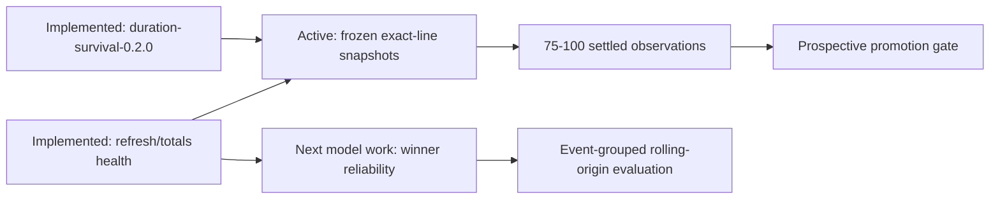
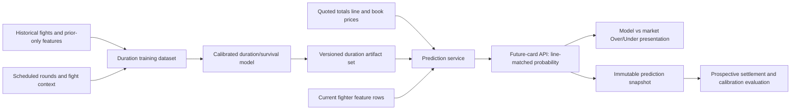

# FightIQ Research Implementation Gameplan and Risk Register

Evidence-based plan for improving prediction quality, fight-duration estimates, market comparison, and operational reliability

Audited repository: `C:\Users\nrmcn\predictor\threejs`

Audited Git baseline: branch `threejs-playground`, tracking `origin/threejs-frontend`; duration release baseline `60d9c84` plus the operational-hardening change set documented here

Audit date: July 21, 2026

Status: standalone implementation plan updated after the experimental duration and refresh-observability implementation

## Document control and decision rules

This plan is derived from the implementation, generated artifacts, local data, experiment records, and current tests in the audited checkout. It is deliberately self-contained.

Evidence is ranked in this order:

1. Reproducible, leakage-safe experiments recorded in this repository.
2. Current local artifact metadata and database/file schemas.
3. Executable source code and tests.
4. Repository documentation that agrees with the implementation.
5. External or conceptual research claims that have not yet been reproduced here.

The label **Current** means implemented at the audited commit. **Proposed** means recommended work. **Experimental** means present but not production-serving. **Legacy/stale** means superseded or contradicted by newer repository evidence. Every numerical acceptance threshold in this document is marked as either an existing baseline or a proposed gate.

## Table of contents

1. Executive decision summary
2. Verified baseline
3. Research reconciliation
4. Target architecture
5. Phased implementation roadmap
6. Fight-duration and totals implementation specification
7. Model and data research tracks
8. Reliability and release engineering
9. Measurement and acceptance gates
10. Risk and concern register
11. Dependencies, sequencing, and rollback
12. Recommended next work session
13. Practical kickoff checklist

# 1. Executive decision summary

FightIQ no longer treats `Model distance`/P(Decision) as the over/under model. **Current:** `duration-survival-0.2.0` predicts a market-independent half-round survival curve; the sportsbook line is used only to query the finished curve. P(Decision) remains separately labeled context. Seven frozen exact-line predictions have settled (six correct), but every prediction selected Over and performance equals the always-Over baseline; the evidence status therefore remains **Very early**.

The recommended sequence is:

1. Freeze the implemented duration version and collect line-matched predictions without event-by-event tuning.
2. Operate the encrypted daily refresh and monitor the persisted heartbeat, provider quota, coverage, match quality, and stale totals snapshots.
3. Automatically grade frozen duration predictions after official results refresh and publish coverage/exclusions.
4. Review at a predeclared 75-100 settled exact-line observations, with adequate five-round representation, before promotion.
5. Build winner reliability/abstention analysis while duration evidence accumulates.
6. Pursue new model features only through event-grouped chronological, leakage-safe gates.

The six existing matchup interaction terms should not simply be wired into production. They were already evaluated across logistic regression, histogram gradient boosting, and XGBoost and were neutral to negative in recorded walk-forward experiments. They become worth revisiting only if new orthogonal inputs—such as reliable style annotations—change what the interactions represent.

## Priority map



# 2. Verified baseline

## 2.1 Product and runtime

The application is a FastAPI backend plus React/Vite frontend. It supports winner predictions, method-derived context, upcoming cards, market odds, saved card snapshots, social picks, leaderboards, evaluation views, fighter profiles, and an optional Three.js scene. SQLite is the live transactional store. CSV, JSON, and joblib artifacts support scraping, feature construction, training, and serving. Docker/Fly deployment packages a frontend build, backend, database, and selected model/data artifacts.

## 2.2 Model baseline

| Item | Verified current state |
|---|---|
| Winner recipe | `backend/app/models/model_version.py`, version 1.3; production protocol hash `d318130478`; frozen candidate-evaluation protocol hash `683f0e4d08` |
| Serving model | Uncalibrated logistic recipe selected on the frozen holdout, then refit on all 8,599 eligible fights for production |
| Latest recorded winner metrics | Frozen holdout: accuracy 0.6355 (95% Wilson interval 0.6124-0.6579); Brier 0.2276; log loss 0.6492; AUC 0.6756. Eight-fold walk-forward mean accuracy: 0.6214 |
| Chronological split | 6,019 training fights; 860 calibration fights; 1,720 untouched test fights |
| Training coverage | March 11, 1994 through July 18, 2026; production refit uses all eligible history after evaluation freeze |
| Method model | Broad and detailed method models; 496 numeric inputs plus categorical `weight_class` |
| Method-derived duration context | Broad method model probability assigned to `Decision`; separately labeled context, never an Over probability |
| Duration model | Experimental discrete-time half-round survival model `duration-survival-0.2.0`; feature schema `duration-survival-features-2`; settlement `ufc-standard-rounds-2` |
| Duration historical split | 6,816 train fights; 1,709 test fights; 5,443 exact-line test observations |
| Duration historical metrics | Accuracy 0.7286; Brier 0.1754; log loss 0.5229; AUC 0.7514; zero monotonicity violations |
| Provenance | Evaluation and production artifacts carry distinct roles, training protocols/hashes, row counts, date ranges, data hashes, Git commit, and dirty-worktree flag |

The latest winner artifact was trained from a dirty worktree. That does not prove the artifact is invalid, but it prevents the Git commit alone from reproducing the exact source state. Before evaluating new ideas, establish a clean and immutable comparison baseline.

## 2.3 Data and market baseline

| Area | Verified current state | Planning consequence |
|---|---|---|
| Historical fights | 8,772 `event_fights` rows in SQLite; exported raw CSV has 8,758 | SQLite and compatibility CSVs can diverge; define authoritative reads |
| Training matchups | 17,198 mirrored rows representing 8,599 unique fights | Split and score by unique fight, never by mirrored row |
| Current fighter features | 2,694 rows and 134 columns | Duration work can reuse only pre-fight-safe columns |
| Upcoming schedule | 8 events/56 fights in SQLite versus 6/51 in CSV | UI freshness must use SQLite or explicit regenerated exports |
| Moneyline odds | Implemented and persisted | Distinguish moneyline availability from totals availability |
| Totals fields | Schema and ingestion code exist | Implementation presence is not coverage |
| Totals coverage | 32 append-only per-book quotes across 8 fights, 4 bookmakers, and lines 1.5/2.5/3.5 | Keep curve-only/no-market states and continue daily prospective capture |
| Frozen duration snapshots | 7 exact-line predictions settled; 6 correct; all 7 selected Over | Evidence is Very early and equals the always-Over baseline; preserve predictions and collect without tuning |
| Odds history | 24 SQLite rows versus 19 CSV rows | Use database-backed evaluation; exports are compatibility outputs |

## 2.4 Validation baseline

At the audited state, local validation passed:

- Backend: 217 tests passed.
- Frontend: lint passed; 41 tests in 12 files passed; production build passed.
- Build warning: the lazy `OctagonScene` bundle is approximately 534 kB minified, above Vite's default 500 kB warning threshold.
- Backend warning: a pandas DataFrame fragmentation warning in an authenticated end-to-end test.

These results are a baseline, not proof that the unattended Windows scheduler, hosted upload, or real external odds and UFCStats integrations work continuously.

# 3. Research reconciliation

## 3.1 Findings that are ready to plan around

| Finding | Evidence in this checkout | Decision |
|---|---|---|
| Duration should be modeled independently and queried at the actual threshold | Current survival curve is market-independent; P(Decision) remains separate | Freeze the version and validate exact-line outputs prospectively |
| Chronological validation is mandatory | Training code and existing tests recognize time order and mirrored fights | Use chronological, unique-fight splits for every experiment |
| Calibration matters as much as discrimination | The product exposes probabilities and market comparisons | Gate on Brier score, log loss, reliability curves, and subgroup calibration—not accuracy alone |
| Round-level history is most relevant to duration | `fight_round_stats.csv` exists with 40,474 rows | Build aggregated prior-round tendencies with strict pre-fight cutoffs |
| Prospective evaluation is needed | Exact-line duration fields, automatic grading, Evaluation UI, and 7 settled frozen predictions now exist; 6/7 is not above the always-Over baseline | Accumulate the predeclared sample without tuning or recomputing old predictions |
| Identity resolution is a platform dependency | Different name normalizers are used for prediction joins, odds, images, and ingestion | Introduce one canonical mapping boundary before broadening external data |

## 3.2 Findings that conflict with repository experiments

| Claim or idea | Stronger local evidence | Status and action |
|---|---|---|
| Six orphan matchup interactions are “free alpha” and should be wired | The exact terms were tested across logistic, histogram gradient boosting, and XGBoost; recorded deltas were neutral to negative | **Rejected for direct implementation.** Reopen only with new inputs or a materially different hypothesis |
| Method prediction is absent from Future Cards | `future_card_service.py` derives distance probability from the method model and `FutureCards.jsx` renders it | **Stale statement.** The value is present, but mislabeled for over/under use |
| Frontend has no automated tests and one fully eager bundle | Current suite has 41 tests and route-level lazy loading | **Historical state.** Add contract/E2E coverage; do not plan from the old count |
| A successful pipeline log proves daily automation is fixed | The chain still depends on Task Scheduler, one Windows account/machine, an Interactive logon session, DPAPI, a local venv, network, and upload auth | **Partially mitigated.** Persisted heartbeat/stale alerts and encrypted odds credential are implemented; the PC can still be offline or signed out |

## 3.3 Ideas requiring new evidence

The following remain reasonable research directions, but none should be represented as an expected production gain:

- Glicko or uncertainty-aware rating features as a shadow alternative to current Elo.
- Round-level pace, damage, control, and durability aggregates for duration and method.
- Beta calibration, isotonic alternatives, or Venn–Abers-style intervals in a shadow comparison.
- Stability selection or regularization-path analysis performed inside training folds.
- Style clustering or hand-labeled archetypes, provided the labels are reproducible and available before the fight.
- Historical closing-line and scorecard enrichment, only from legally permitted, stable sources.

# 4. Target architecture

The duration capability should be a distinct, versioned model family rather than a rename of the method output.



The service contract should preserve the distinction between three concepts:

- `decision_probability`: method model probability that the result is a decision.
- `over_probability`: duration model probability that elapsed time exceeds the quoted threshold.
- `market_over_probability`: de-vigged market probability for the same threshold and source timestamp.

No UI should subtract probabilities that refer to different events or different lines.

# 5. Phased implementation roadmap

## Phase 0 — Integrity and observability foundation

**Current status: partially implemented.** Refresh runs now persist a secret-free `data_refresh_runs` heartbeat that survives bundle upload. Data Ops shows freshness, degraded stages, odds status/quota, totals coverage/history, and duration collection. Unified artifact manifests, atomic generation switching, and canonical fighter identity remain open.

Objective: make every later result reproducible and make “fresh” a measurable state.

| Work item | Key files/components | Deliverable | Exit condition |
|---|---|---|---|
| Clean comparison baseline | `backend/app/training/train_model.py`; winner artifact metadata | A retrain from a clean commit or an immutable source diff captured in the manifest | Artifact can be reproduced or its exact non-Git inputs are archived |
| Artifact manifest | `deploy/make_bundle.py`; model registry; training scripts | JSON manifest with SHA-256, row counts, schemas, versions, Git state, and timestamps | Backend refuses or warns on incompatible/missing members |
| Shared pipeline registry | `backend/app/pipeline/incremental_pipeline.py`; `full_pipeline.py` | One declarative dependency list reused by both runners | Automated parity test proves required stages and ordering constraints |
| Refresh heartbeat | `backend/app/pipeline/auto_update.py`; admin settings/report; Data Ops UI | Last attempt, last success, failed stage, artifact age, upload result | Stale or failed refresh is visible without reading local logs |
| Authoritative-store policy | SQLite accessors and compatibility exporters | Explicit database ownership plus generated-export labels | Consumers no longer silently prefer stale CSVs |
| Identity boundary | ingestion, prediction, odds, image services | Canonical fighter ID/alias resolver with unresolved-match queue | Cross-source joins use one service and log match confidence |

Rollback: these are additive controls. Keep legacy paths callable behind a temporary compatibility switch until manifest, pipeline, and resolver tests pass.

## Phase 1 — Totals ingestion and coverage

**Current status: implemented prospectively.** The provider request includes `h2h,totals`; the current table retains one consensus line per fight, while `totals_odds_snapshots` appends every matched per-book quote and alternate line. At the snapshot it contained 32 quotes across 8 fights and 4 books.

Objective: prove that the application can receive, normalize, store, and display book totals for upcoming fights.

Actions:

1. Confirm the configured odds provider and account tier actually return the `totals` market for MMA.
2. Persist book, event, fighter mapping, line, Over/Under prices, source timestamp, fetch timestamp, and matching confidence.
3. Define aggregation behavior when books quote different lines. The current “most common line” may be retained initially, but the original per-book quotes must remain available.
4. Add coverage metrics by event and fight: moneyline available, totals available, books count, latest age, and unresolved identity matches.
5. Add fixture-driven tests for line disagreement, one-sided prices, pushes, missing outcomes, duplicate books, and stale quotes.
6. Render an explicit “Totals unavailable” state; never substitute `P(Decision)` for missing market data.

Exit condition: a representative upcoming-card fixture and at least one live authorized fetch populate line and both sides consistently; coverage is independently visible in Data Ops and Future Cards.

## Phase 2 — Duration dataset and baseline model

**Current status: implemented as an experimental baseline.** `duration_features.py`, `duration_settlement.py`, and `train_duration_model.py` produce `duration-survival-0.2.0`. The chronological 80/20 artifact beats the same-line training base-rate baseline on Brier/log loss, but remains a one-split historical result.

Objective: build a leakage-safe baseline that answers the quoted-line question.

Actions:

1. Create a unique-fight duration table from completed-event date, scheduled rounds, official finish round/time, result status, weight class, bout type, and fighter identities.
2. Convert round/time into elapsed seconds with tested boundary rules.
3. Join only feature snapshots whose cutoff precedes the event.
4. Start with two baselines:
   - calibrated binary classifiers for standard thresholds represented in available history; and
   - a discrete-time hazard or survival model that estimates a full survival curve.
5. Evaluate both on identical chronological unique-fight folds.
6. Select the simplest approach that produces reliable line-specific calibration and supports current lines without proliferating fragile models.

Exit condition: the trainer produces a versioned model, feature contract, metrics report, lineage manifest, and reproducible out-of-fold predictions. No serving code changes are required to reach this gate.

## Phase 3 — Shadow serving and snapshot evaluation

**Current status: implemented and collecting.** Future Cards receives a curve even without a market line, exact-line values are snapshotted only when the saved model and market lines agree, Evaluation grades them from official results, and the incremental pipeline runs that grader after results ingestion.

Objective: run the candidate without changing the public interpretation of Future Cards.

Actions:

- Load the duration artifact through the model registry and validate its schema/version.
- Calculate a prediction only when fighters, scheduled rounds, and a supported totals line are available.
- Store `line`, `over_probability`, `under_probability`, model version, artifact hash, source timestamp, feature-coverage flags, and prediction timestamp.
- Expose results first through an admin/debug response or Data Ops panel.
- Settle saved predictions after results refresh using the same boundary function used for training labels.
- Track coverage, Brier score, log loss, calibration, and confidence intervals prospectively.

Exit condition: shadow predictions survive at least one full event lifecycle from pre-fight snapshot through result settlement with no manual database edits.

## Phase 4 — Future Cards presentation

**Current status: implemented with neutral language.** The compact card keeps the winner primary and shows only the duration side/line/probability or `Curve ready / Awaiting market O/U`. The expanded breakdown contains the full curve, market comparison, and separately labeled P(Decision) context.

Objective: show a line-matched comparison without overstating certainty.

Recommended row:

| Display element | Example | Rule |
|---|---|---|
| Book line | Over/Under 2.5 rounds | Show source/book count and quote age |
| Market | Over 58% / Under 42% | De-vig both sides from the same line |
| Model | Over 54% / Under 46% | Same line; show model version in details |
| Difference | Model − market: −4 pts on Over | Neutral comparison language initially |
| Context | Decision probability 48% | Optional, separately labeled; never called the 2.5-round probability |
| Availability | Duration model unavailable | Give a reason category without exposing sensitive internals |

Do not label a side as a bet, edge, or recommendation until the prospective evaluation gate is met and product language is explicitly approved.

Exit condition: API, frontend mock fixtures, UI tests, responsive states, saved snapshots, and interpretation documentation agree on the same field definitions.

## Phase 5 — Prospective gate and controlled promotion

**Current status: active, not passed.** Seven exact-line predictions have settled; six were correct, but all seven selected Over and therefore equal the always-Over baseline. Do not tune the artifact after each card or strengthen product language before the predeclared review.

Objective: determine whether line-specific estimates are useful and stable enough for stronger presentation.

Promote only when:

- every scored prediction was saved before the relevant fight and market close;
- market and model refer to the identical line;
- settlement rules are verified against official results and target-book rules;
- coverage and exclusions are published with results;
- confidence intervals do not support a material regression versus the declared baseline;
- subgroup calibration is acceptable for 3-round/5-round fights and high-volume weight classes;
- no training/serving feature mismatch or identity error was observed in the evaluation set.

Working sample gate: first formal review at 75-100 line-matched, prospectively saved and settled fights, with a nontrivial five-round cohort. This is a pragmatic early gate, not an established statistical guarantee; power and uncertainty should be recalculated from observed event rates before any promotion.

# 6. Fight-duration and totals implementation specification

## 6.1 Target definition

Let `T` be official elapsed fight time in seconds and `L` be the sportsbook threshold converted to seconds. The primary prediction target is:

`over = 1 if T > L, otherwise 0`, subject to the selected book's void/push rules.

Examples under the commonly used half-round interpretation:

| Market line | Candidate threshold conversion | Example outcome |
|---|---:|---|
| 1.5 rounds | 450 seconds | Finish at 2:31 of Round 2 has elapsed 451 seconds and is Over |
| 2.5 rounds | 750 seconds | Finish at 2:31 of Round 3 has elapsed 751 seconds and is Over |
| 4.5 rounds | 1,350 seconds | Finish at 2:31 of Round 5 has elapsed 1,351 seconds and is Over |

**Implementation caution:** the exact equality boundary, cancellations, technical decisions, no contests, overturned results, and unusual round lengths must be verified against the rules of the market source being displayed. Encode them once in a settlement module and use the same function for labels, API grading, and tests.

## 6.2 Candidate model form

Preferred first comparison:

- Baseline A: calibrated logistic model per supported threshold or with line as an explicit input.
- Candidate B: discrete-time hazard model with intervals within rounds, from which `P(T > L)` is read directly.

The survival form is attractive because one model can produce coherent probabilities across 1.5, 2.5, and 4.5 lines and can expose the full duration curve. It is not automatically superior. Promote it only if calibration and stability beat the simpler baseline under identical folds.

Avoid training only a “goes to decision” classifier. That target collapses all late finishes into the Under side for every line and cannot support arbitrary thresholds.

## 6.3 Feature policy

Candidate features must be known before the fight and calculated from prior bouts only:

| Feature family | Examples | Primary safeguard |
|---|---|---|
| Fight context | Scheduled rounds, weight class, title/main-event indicators if reliably encoded | Schema and value-domain tests |
| Activity and experience | Prior UFC bouts, days since last fight, recent bout count | Event-date cutoff tests |
| Prior duration | Mean/median elapsed time, decision rate, early/late finish rates | Minimum-sample shrinkage; no current-fight result |
| Pace and output | Prior attempts/landed per minute, position-specific activity | Denominator and zero-time tests |
| Durability | Prior knockdowns absorbed, stoppage history, damage-rate proxies | Missingness and sparse-sample flags |
| Control/grappling | Prior control share, takedown/submission attempts | Round aggregation verified against source schema |
| Matchup differences | Symmetric fighter A/B differences and sums | Red/blue swap invariance test |
| Market line | Threshold seconds or round fraction | Never use post-close outcome or closing price in a pre-open model |

Do not import the existing six interaction terms by default. If new style features justify new interactions, define the hypothesis before looking at the final holdout and test them as a bounded ablation.

## 6.4 Dataset contract

Current files/modules:

- `backend/app/features/duration_features.py`: symmetric prior-only feature assembly.
- `backend/app/models/train_duration_model.py`: unique-fight chronological split, hazard interval expansion, training, and metrics.
- `backend/app/services/duration_prediction_service.py`: artifact load/compatibility checks, curve inference, exact-line query, and reason-coded unavailable states.
- `backend/app/services/duration_settlement.py`: one tested source of truth for elapsed time and result exclusions.
- `backend/app/services/duration_evaluation_service.py`: historical artifact readout and prospective exact-line grading.
- `backend/app/repositories/totals_odds_snapshots_repository.py`: append-only per-book totals history.
- `backend/app/services/data_operations_health_service.py`: refresh/totals/duration operational telemetry.

One row should represent one fight/line evaluation unit. If multiple lines per historical fight are synthesized for training, group every derived row from the fight into the same fold and report performance separately by actual-versus-synthetic line availability.

## 6.5 Artifact contract

Current artifact family:

| Artifact | Required contents |
|---|---|
| `duration_model.joblib` | Fitted calibrated pipeline or survival estimator |
| `duration_model_features.json` | Ordered numeric features, categorical features, definitions, null/default policy, schema version |
| `duration_model_metrics.json` | Splits, metrics, reliability summaries, subgroup counts, exclusions, lineage |
| Registry entry | **Gap:** duration versions live inside the artifact/feature/metrics payloads, but no unified duration registry entry exists yet |
| Out-of-fold predictions | **Gap:** recent test results are in metrics JSON; a durable full out-of-fold file is still recommended |

The serving process must reject an artifact when its feature-schema version, ordered feature list, or preprocessing version does not match the serving builder.

## 6.6 API contract

Current response fragment (abridged):

```json
{
  "duration_prediction": {
    "line": 2.5,
    "status": "ready",
    "over_probability": 0.54,
    "under_probability": 0.46,
    "curve": [{"line": 0.5, "over_probability": 0.89, "under_probability": 0.11}],
    "model_version": "duration-survival-0.2.0",
    "feature_schema_version": "duration-survival-features-2",
    "promotion_status": "experimental",
    "market_inputs_used": false,
    "market_line_role": "query_only",
    "generated_at": "2026-07-13T18:00:00Z"
  }
}
```

When unavailable, return a stable reason code such as `totals_line_missing`, `fighter_unresolved`, `unsupported_round_format`, `feature_row_missing`, or `artifact_unavailable`. Do not manufacture a percentage from the method model.

During migration, keep `model_distance_probability` only as a deprecated, explicitly defined decision probability. Remove it after all consumers and saved snapshots have migrated.

## 6.7 Tests required before display

- Finish-time conversion for every round and exact half-round boundaries.
- Five-round, three-round, one-round anomaly, no-contest, draw, overturned, and missing-time fixtures.
- Mirrored-row and chronological group isolation.
- Training/serving feature-name, order, dtype, category, and null-policy equality.
- Red/blue swap invariance or documented complement behavior.
- Calibration and metric calculation on fixed fixtures.
- API contract, unavailable reason codes, frontend mock parity, and UI responsive states.
- Snapshot immutability, settlement idempotence, and no post-fight overwrite.
- Multiple books/lines, de-vigging, quote age, and exact line matching.
- Artifact incompatibility and rollback behavior.

# 7. Model and data research tracks

These tracks can begin only after Phase 0 establishes reproducible baselines. They should not compete for the same untouched final holdout.

## 7.1 Round-level duration features — highest modeling priority

Use `backend/data/processed/fight_round_stats.csv` to create prior-only aggregates such as early-round output, pace decay, control share, knockdown exposure, and finish timing. Every aggregate needs a cutoff test proving that fight `N` does not use round data from fight `N` or later. Add empirical-Bayes shrinkage or explicit sample-size features so a one-fight athlete is not treated as precisely estimated.

Why first: these variables directly describe the process that determines duration. They are more causally aligned with totals than generic winner interactions.

## 7.2 Glicko or uncertainty-aware ratings — shadow comparison

Implement a rating provider behind the same feature interface as current Elo. Produce pre-fight rating, rating deviation/uncertainty, and matchup differences. Compare:

- current Elo only;
- Glicko-style features only; and
- both, with regularization.

Gate on chronological out-of-fold log loss and Brier score for winner prediction, plus calibration by experience. Do not replace Elo merely because the new rating is theoretically richer.

## 7.3 Calibration alternatives

Compare the selected uncalibrated logistic recipe against carefully nested calibration alternatives. Fit calibration without touching the final test period. Evaluate reliability, expected calibration error, proper scores, and bootstrap intervals; reject sharper-looking probabilities that worsen log loss or destabilize the tails.

## 7.4 Feature stability and selection

Measure coefficient/sign stability and feature selection frequency across chronological folds. Any filtering, imputation choice, or hyperparameter selection must occur within the training portion of each fold. Use this to simplify feature families and identify brittle inputs, not to mine the final holdout repeatedly.

## 7.5 Style representation and new interactions

If style labels are added, first define how they are produced, versioned, and available before each historical fight. Candidate sources include reproducible clustering from prior-only round features or human-reviewed labels with inter-rater checks. Only then test bounded interactions such as pace-versus-durability or wrestling-pressure-versus-takedown-defense. This is the condition under which revisiting interaction hypotheses becomes meaningfully new research.

## 7.6 Historical odds and scorecards

Before ingestion, verify terms of use, licensing, update stability, identity coverage, and historical timestamp semantics. Closing odds cannot be used as an input to a model presented as an earlier pre-fight forecast. Scorecards can support judging and round-outcome research but have sparse and selection-biased availability; keep them out of production features until coverage and missingness are documented.

# 8. Reliability and release engineering

## 8.1 Daily refresh

**Current:** Windows Task Scheduler launches `deploy/auto_update.ps1`, which decrypts separate DPAPI-protected admin and Odds API credentials, runs `deploy/auto_update.py`, executes the incremental pipeline, builds a bundle, and uploads it. Each run writes a compact `data_refresh_runs` heartbeat into SQLite; bundle sync merges that table into the hosted DB. Data Ops shows run age/success, degraded stages, odds status/quota, current totals coverage, append-only history, match warnings, and prospective duration counts. Provider failure preserves the last good odds, pushes otherwise safe data, and returns a non-zero scheduled-task result. The registered task uses the `Interactive` logon type, so it catches up after the user logs on but cannot run while that account is signed out.

Remaining improvements:

- Extend the heartbeat with bundle hash and explicit post-upload verification result.
- Add a post-upload hosted health check that verifies manifest hash, database row counts, model versions, and latest event date.
- Move the runner to an always-on CI/hosted system when credentials, scraping constraints, and cost permit. Until then, document that a sleeping/offline Windows machine cannot guarantee wall-clock daily execution.

## 8.2 Atomic artifact deployment

**Current risk:** a bundle upload replaces files sequentially. Requests can observe a new model with old features or a new database with old metadata.

Target flow:

1. Upload into a versioned staging directory.
2. Validate archive paths, manifest, checksums, schema compatibility, model load, and a smoke prediction.
3. Quiesce or use a generation pointer.
4. Switch the whole artifact generation atomically.
5. Retain the previous generation for one-command rollback.
6. Report the active generation/hash through `/health` or an admin status endpoint.

## 8.3 Typed contracts

Many FastAPI routes return untyped dictionaries and the frontend API client has handwritten assumptions. Introduce Pydantic response models for high-change endpoints, generate or validate frontend types from OpenAPI, and run a real-backend contract test in CI. Keep mocks as scenario fixtures, not as the definition of the production contract.

## 8.4 Database and schema evolution

The database currently relies on `PRAGMA user_version=1` plus forward-compatible column/table creation. Duration snapshots, totals history, and refresh heartbeat are present, but add numbered, idempotent migrations and a compatibility matrix before changing their semantics. Future migrations must preserve old rows and identify which model/line/settlement version produced them.

# 9. Measurement and acceptance gates

## 9.1 Universal experiment gate

Every candidate must declare before the final evaluation:

- hypothesis and expected mechanism;
- primary metric and minimum useful change;
- unit of independence: unique fight;
- chronological train, calibration, and untouched test windows;
- feature availability timestamp;
- comparison baseline and identical eligible rows;
- subgroup and missingness plan;
- artifact and code provenance;
- promotion, rejection, and rollback rule.

## 9.2 Duration metrics

| Metric | Purpose | Gate principle |
|---|---|---|
| Brier score | Probability accuracy | No material regression against declared baseline on line-matched fights |
| Log loss | Penalizes confident errors | Primary paired comparison when probabilities are the product |
| Calibration curve/intercept/slope | Reliability | No systematic overconfidence; inspect 3- and 5-round subgroups |
| ROC AUC | Ranking | Secondary only; good AUC cannot rescue poor calibration |
| Coverage | Operational usefulness | Report denominator and every exclusion reason |
| Line agreement | Contract integrity | 100% of scored comparisons use exactly matching model and market lines |
| Prospective result | Real-world stability | Only immutable pre-fight snapshots count |

Existing winner-model values in Section 2 are comparison baselines for winner work, not duration acceptance thresholds.

## 9.3 Proposed promotion rule

Use paired bootstrap intervals on identical fights. Promote only if the candidate improves or is statistically compatible with the simpler baseline on the primary proper score, preserves calibration and key subgroups, and justifies its complexity. Define “material” before the final test; never choose a favorable threshold after seeing results.

# 10. Risk and concern register

| ID | Severity | Concern | Likely impact | Mitigation / decision |
|---|---|---|---|---|
| R1 | Critical | Historical duration results could be mistaken for proven live edge | Overconfident product language and premature tuning | Keep experimental status, neutral display, frozen versions, and predeclared prospective gate |
| R2 | High | Totals coverage is sparse: 32 quotes across 8 fights at snapshot | Small/line-biased prospective comparison | Continue append-only capture; report fight/book/line coverage and unavailable states |
| R3 | Critical | Model artifacts and most generated data are ignored and the current winner artifact records a dirty worktree | Irreproducible baselines and accidental artifact drift | Immutable manifest, hashes, clean-source requirement or archived diff |
| R4 | Critical | Bundle members are replaced sequentially | Mixed incompatible generations during requests | Stage, validate, and atomically switch versioned generations |
| R5 | High | Full and incremental pipelines duplicate stage lists and ordering | A fix can update one path but not the other | Shared declarative stage registry and parity tests |
| R6 | High | Name normalization differs across prediction, odds, images, and ingestion | Wrong or missing fighter joins; silent odds mismatch | Stable fighter IDs, alias registry, confidence and review queue |
| R7 | High | Scheduler depends on one Windows account/machine, DPAPI, venv, connectivity, and machine availability | A sleeping/offline PC can still miss wall-clock execution | Implemented heartbeat/stale alert; add external notification and eventual always-on runner |
| R8 | High | Current SQLite and compatibility CSV row counts diverge | Training, UI, and debugging can use different “current” data | Define ownership; generate exports with timestamps/manifests |
| R9 | High | Duration labels have bookmaker-specific boundary and void rules | Wrong training targets and grading at exact boundaries | One versioned settlement module with provider-specific fixtures |
| R10 | High | Mirrored matchup rows can cross validation folds | Leakage and exaggerated model performance | Group by canonical fight ID; assert fold isolation |
| R11 | High | Retrospective model snapshots can be overwritten or created after outcomes | Inflated prospective evaluation | Immutable timestamped snapshots and idempotent settlement |
| R12 | High | Repository prose recommends interactions contradicted by recorded experiments | Repeating failed work and holdout mining | Mark rejected result and require a new hypothesis/input |
| R13 | Medium | FastAPI response dictionaries and handwritten frontend client are weak contracts | Runtime UI breakage after API edits | Pydantic responses, generated/validated types, real-API CI |
| R14 | Medium | Market aggregation can collapse books with different totals lines | Invalid average and model-market comparison | Retain per-book quotes; aggregate only identical lines or state method |
| R15 | Medium | Odds, scorecard, or image sources may have licensing/ToS constraints | Forced removal, blocked scraper, or legal exposure | Source review and documented permitted use before expansion |
| R16 | Medium | Sparse fighters and missing round history create unstable duration estimates | Confident-looking probabilities from thin data | Shrinkage, sample-size features, coverage flags, subgroup calibration |
| R17 | Medium | Large backend services and frontend views concentrate responsibilities | Risky changes and slow review | Extract duration/settlement/contract modules behind tests |
| R18 | Medium | SQLite migration mechanism is minimal | Hosted upgrade or rollback failures | Numbered migrations and tested upgrade/downgrade policy |
| R19 | Medium | Tracked generated odds JSON can leave routine working trees dirty | Accidental commits and ambiguous provenance | Decide fixture vs live artifact; move live copy to ignored storage |
| R20 | Medium | About 127 MB of tracked UI-review material and duplicate snapshots | Repository bloat and confusing “current” UI evidence | Archive/remove superseded assets and retain a curated latest set |
| R21 | Low | Three.js chunk exceeds the default size warning | Slower first load when scene is opened | Profile, split dependencies/assets, set a measured budget |
| R22 | Low | Deprecated FastAPI startup hook and pandas fragmentation warning | Future framework break and avoidable performance cost | Move to lifespan API; assemble feature columns in batches |

# 11. Dependencies, sequencing, and rollback

## 11.1 Dependency matrix

| Workstream | Must precede it | Downstream unlocks | Rollback unit |
|---|---|---|---|
| Manifest and clean baseline | None | Trustworthy experiments and deploys | Previous artifact generation |
| Shared pipeline/refresh status | Manifest recommended | Reliable data and prospective tracking | Legacy runner plus status fields ignored |
| Canonical identity | Schema/migration plan | Odds, images, cross-source research | Alias resolver compatibility mode |
| Totals ingestion | Identity and coverage telemetry | Duration market comparison | Hide totals fields; retain moneyline |
| Duration dataset/model | Clean baseline; settlement rules | Shadow duration service | Disable duration registry entry |
| Snapshot settlement | Duration API contract; DB migration | Prospective evaluation | Preserve rows, stop new writes |
| Public UI | Shadow lifecycle and tests | User-facing model comparison | Feature flag or response omission |
| Edge language | Prospective sample and review | Stronger product positioning | Return to neutral comparison wording |

## 11.2 Suggested working increments

1. **Completed:** totals snapshots, duration artifact/curve, exact-line UI, historical/prospective Evaluation, encrypted odds credential, heartbeat, and Data Ops health.
2. Next pull request: no-post-fight-overwrite/full-event lifecycle test plus hosted post-upload verification and external failure notification.
3. Next model pull request: winner reliability/abstention cohorts under event-grouped rolling-origin evaluation.
4. Platform pull request: canonical fighter identity service adopted first by odds ingestion.
5. Release-engineering pull request: artifact manifest and atomic generation switch.
6. Duration review pull request only after the predeclared settled-sample gate; do not tune between events.

Small, reversible increments make it clear which change caused any data, calibration, or deployment regression.

## 11.3 Stop conditions

Pause the duration rollout when:

- totals cannot be obtained reliably or permissibly;
- settlement semantics cannot be verified for the displayed source;
- canonical fighter matching produces unresolved or ambiguous high-profile bouts;
- training and serving features cannot be shown identical;
- artifact provenance is incomplete;
- shadow results reveal calibration failure or line mismatches;
- deployment cannot guarantee a coherent artifact generation.

# 12. Recommended next work session

The best next work is to operate and validate what has just shipped, while beginning winner-reliability work that does not contaminate the frozen duration experiment.

Recommended scope:

1. Let `duration-survival-0.2.0` collect frozen exact-line predictions; review Data Ops after every scheduled run, not the model after every card.
2. Add a full event-lifecycle test proving a pre-fight snapshot survives result ingestion and cannot be recomputed post-fight.
3. Add external notification and a post-upload hosted verification/hash so local failure is visible without opening FightIQ.
4. Build winner reliability cohorts for debutants, low UFC sample, missing features, long layoffs, weight moves, and replacement bouts; define downgrade/abstain behavior.
5. Upgrade winner evaluation to event-grouped rolling-origin folds before choosing a new winner feature family.
6. Begin canonical fighter IDs/name aliases after the monitoring slice.

Review the duration model only when the predeclared prospective count is reached or a real integrity failure is discovered. This avoids test-set-by-test-set tuning while other high-value work continues.

# 13. Practical kickoff checklist

- Confirm the working tree and record unrelated changes before editing.
- Confirm the active database, model registry, and artifact generation.
- Create or verify a clean reproducible winner baseline; do not compare against an unexplained dirty artifact.
- Choose the totals provider/source and verify permitted access and exact settlement rules.
- Add fixtures before relying on live external responses.
- Define the canonical fight ID and fighter identity mapping used by labels, odds, snapshots, and results.
- Write the finish-time conversion and boundary tests before generating duration labels.
- Audit unique fights, exclusions, missing values, era coverage, scheduled rounds, and target balance.
- Freeze the chronological split and untouched final test period.
- Declare primary metric, baseline, minimum useful change, and promotion rule.
- Store out-of-fold predictions and full provenance for every candidate.
- Keep duration artifacts separate from winner and method artifact families.
- Run backend tests, frontend lint/tests/build, API contract checks, and a real-data smoke test.
- Exercise a full pre-fight snapshot through result settlement before public display.
- Ship neutral model-versus-market wording first; keep `P(Decision)` separately labeled.
- Maintain a feature flag and previous coherent artifact generation for rollback.
